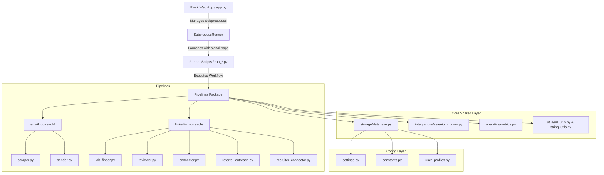
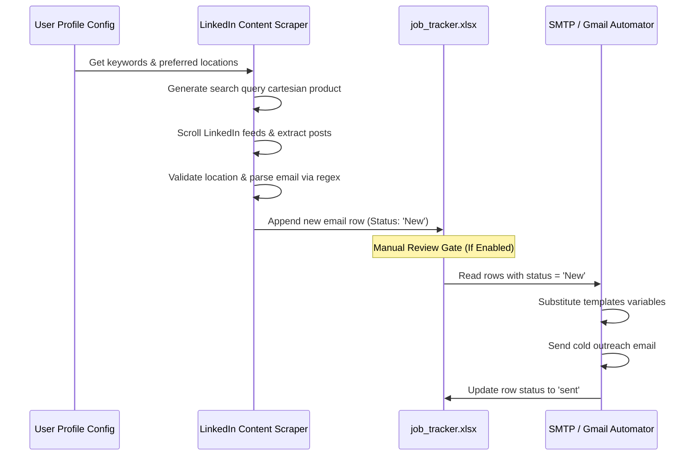
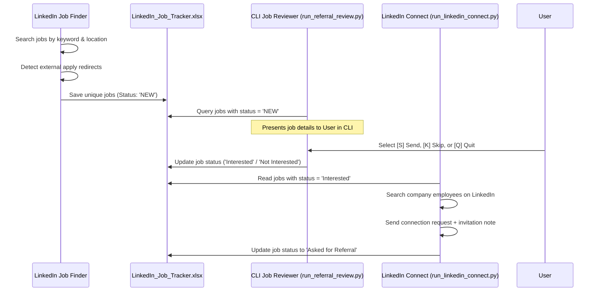
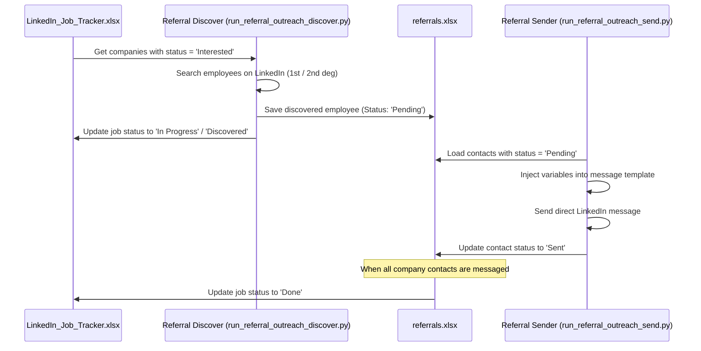
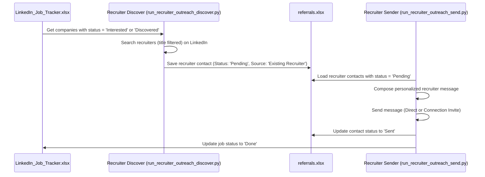

# Connectify – Automated LinkedIn Job Application & Outreach Hub

Connectify is an enterprise-grade, modular job search automation framework and cold-outreach engine. It bridges the gap between active job seeking and professional networking by automating the process of finding job postings, scraping contact emails, sending referral request messages, connecting with recruiters, and organizing all tracking data in isolated Excel databases.

Connectify includes a sleek, modern, web-based control panel built on Flask that features real-time log streaming, profile management, and interactive database administration.

---

## 🏗️ Technical Architecture & Workflow

Connectify is built on clean architectural principles, separating cross-cutting configuration layers, common core utilities, storage APIs, and pipeline execution modules.

### Component Architecture



---

### Pipeline Data Flows

#### 1. Pipeline 1: Email Scraper & Cold Outreach Data Flow


#### 2. Pipeline 2–4: LinkedIn Job Discovery & Application Flow


#### 3. Pipeline 5: Two-Stage Referral Outreach Flow


#### 4. Pipeline 6: Recruiter outreach Flow


---

### Process Lifecycle & Signal Handling

All wrapper scripts (`run_*.py`) follow a standardized lifecycle orchestrated by [app.py](file:///e:/Connectify/app.py)'s `SubprocessRunner`:

```
Web Dashboard UI (Kill Request)
       |
       v
app.py (SubprocessRunner.kill())
       |
       +---> Sets status = "killed" (invariant: never overwritten by exit handlers)
       |
       +---> Sends signal.SIGTERM (or process.terminate() on Windows)
       |
       v
Runner Script (SIGTERM handler caught)
       |
       v
sys.exit(0) ---> Triggers Python 'finally' block cleanup
       |
       v
Selenium Driver Module (driver.quit() executed cleanly)
```

---

## 📁 Project Directory Layout & Code Components

Here is the modular structure of the project directory. Each key folder and file has a specific, isolated role:

* [app.py](file:///e:/Connectify/app.py): The main web dashboard server. Manages asynchronous runner scripts through the `SubprocessRunner` wrapper class.
* [config/](file:///e:/Connectify/config): Configuration and metadata layer.
  * [settings.py](file:///e:/Connectify/config/settings.py): Resolves file pathways dynamically at runtime based on the active user profile (sandboxing folders).
  * [constants.py](file:///e:/Connectify/config/constants.py): Static database schemas, Excel column header formats, and default search keywords.
  * [user_profiles.py](file:///e:/Connectify/config/user_profiles.py): Handles loading, saving, and migrating user-specific credentials, tag configurations, and message templates.
  * [email_templates.py](file:///e:/Connectify/config/email_templates.py): Static fallback templates for outreach messages.
* [core/](file:///e:/Connectify/core): Shared core framework.
  * [analytics/metrics.py](file:///e:/Connectify/core/analytics/metrics.py): Analyzes Excel records to compile KPI metrics for the dashboard.
  * [storage/database.py](file:///e:/Connectify/core/storage/database.py): Handles openpyxl database reads and writes. Features auto-incrementing ID generators, schema enforces, and AppleScript spreadsheet refreshers on macOS.
  * [integrations/selenium_driver.py](file:///e:/Connectify/core/integrations/selenium_driver.py): Chrome profile configurator. Keeps browser sandboxes isolated under `users/<username>/chrome-profile/`.
  * [integrations/url_shortener.py](file:///e:/Connectify/core/integrations/url_shortener.py): Connects with TinyURL API GET endpoints to shorten company apply links.
  * [logging/config.py](file:///e:/Connectify/core/logging/config.py): Implements a `DynamicUserFileHandler` that routes logs dynamically based on the active user.
  * [utils/string_utils.py](file:///e:/Connectify/core/utils/string_utils.py): Regex matching patterns to extract emails from post text.
  * [utils/url_utils.py](file:///e:/Connectify/core/utils/url_utils.py): Decodes safety redirects, parses job URNs, and normalizes career site URLs.
* [pipelines/](file:///e:/Connectify/pipelines): Domain-specific automation tasks.
  * [email_outreach/](file:///e:/Connectify/pipelines/email_outreach): Pipeline 1. Contains [services/scraper.py](file:///e:/Connectify/pipelines/email_outreach/services/scraper.py) (scraping emails from posts) and [services/sender.py](file:///e:/Connectify/pipelines/email_outreach/services/sender.py) (sending outreach emails via SMTP/browser).
  * [linkedin_outreach/](file:///e:/Connectify/pipelines/linkedin_outreach): Pipeline 2-6. Contains [services/job_finder.py](file:///e:/Connectify/pipelines/linkedin_outreach/services/job_finder.py) (finding jobs), [services/reviewer.py](file:///e:/Connectify/pipelines/linkedin_outreach/services/reviewer.py) (CLI reviewer), [services/connector.py](file:///e:/Connectify/pipelines/linkedin_outreach/services/connector.py) (messaging 1st-degree connections and sending connection requests), [services/referral_outreach.py](file:///e:/Connectify/pipelines/linkedin_outreach/services/referral_outreach.py) (two-stage referral outreach), and [services/recruiter_connector.py](file:///e:/Connectify/pipelines/linkedin_outreach/services/recruiter_connector.py) (recruiter outreach).
* **[GIT IGNORED]** `users/`: Sandboxed folder created dynamically on runtime.
  * `users/active_user.json`: Stores the current active username.
  * `users/<username>/`: Private directory structure isolated per user:
    * `users/<username>/config.json`: Stores user-specific settings, templates, and tags.
    * `users/<username>/data/`: Dedicated databases (`job_tracker.xlsx`, `LinkedIn_Job_Tracker.xlsx`, `referrals.xlsx`).
    * `users/<username>/logs/`: Private runtime logs (`automation.log`, `linkedin_connect.log`).
    * `users/<username>/resumes/`: Uploaded applicant PDF/DOCX resumes.
    * `users/<username>/chrome-profile/`: Isolated Chrome cache and session profiles.
* [static/](file:///e:/Connectify/static) & [templates/](file:///e:/Connectify/templates): Front-end CSS, JS, and HTML templates for the web dashboard.
* Root Runner Scripts: `run_*.py` wrapper entry points.
* [update_project.py](file:///e:/Connectify/update_project.py): One-command git updater script.

---

## 🚀 Installation & Onboarding Guide

Follow these steps to set up Connectify on your local machine.

### System Requirements & Prerequisites
1. **Google Chrome**: Ensure the latest standard Google Chrome browser is installed.
2. **Git**: Ensure Git is installed for fetching code updates.
3. **Python**: Python 3.9 or higher is required.

### Step 1: Clone the Codebase
Open your command prompt or terminal and run:
```bash
git clone https://github.com/lalitkumardhanjani/Connectify.git
cd Connectify
```

### Step 2: Set Up Virtual Environment & Dependencies

#### On macOS and Linux:
```bash
python3 -m venv .venv
source .venv/bin/activate
pip install -r requirements.txt
```

#### On Windows (PowerShell or CMD):
```powershell
python -m venv .venv
.venv\Scripts\activate
pip install -r requirements.txt
```

> [!TIP]
> **VS Code Interpreter Resolution**:
> If VS Code reports `ModuleNotFoundError: No module named 'flask'`, press `Ctrl+Shift+P` (or `Cmd+Shift+P` on Mac), search for **`Python: Select Interpreter`**, and select the interpreter pointing to the local `./.venv` directory.

### Step 3: Copy Environment Templates
Copy the template `.env.example` file to `.env`:
* **macOS/Linux**: `cp .env.example .env`
* **Windows**: `copy .env.example .env`

---

## ⚙️ Configuration System Reference

Connectify uses a hybrid configuration system split between global environmental variables and sandboxed user profiles.

### 1. Global Configuration (`.env`)
The `.env` file handles browser profiles, fallback credentials, and limits.

| Variable Name | Default Value | Purpose / Recommendations |
|---|---|---|
| `LINKEDIN_EMAIL` | `your.email@example.com` | Primary account email used for LinkedIn login. |
| `LINKEDIN_PASSWORD` | `your_linkedin_password` | Primary account password for automated login. |
| `SEARCH_KEYWORDS` | `SQL Server DBA` | Fallback keywords if not defined in the user profile. |
| `SEARCH_LOCATION` | `Bangalore, Karnataka, India` | Target location used for searches. |
| `SEARCH_TIME_RANGE` | `r604800` | LinkedIn date range filter. `r604800` limits results to the last 24 hours. |
| `DRY_RUN` | `1` | Set to `1` to test pipelines without executing final outreach sends. Set to `0` for production. |
| `MAX_RUN_DURATION_SECONDS`| `600` | Safety cut-off duration for automation runs. |
| `CHROME_PROFILE_DIR` | `.chrome-profile` | Legacy global Chrome profile storage location. |
| `CHROME_BINARY_PATH` | *Optional* | Absolute path to Google Chrome binary (e.g. `C:\Program Files\Google\Chrome\Application\chrome.exe` on Windows). |

### 2. User-Specific Profiles (`users/<username>/config.json`)
Created automatically during first-time launch or dashboard onboarding.

* **`profile`**: Candidate demographic details (First Name, Last Name, Phone, Resume URL, etc.).
* **`email_scraper`**: Custom search keywords, excluded terms, and email templates for Pipeline 1.
* **`linkedin_connect`**: Timing intervals, connection limit targets, and personalized note templates for Pipeline 4.
* **`recruiter_outreach`**: Message templates and limits for recruiter outreach (Pipeline 6).
* **`referral_outreach`**: Message templates and limits for employee referral outreach (Pipeline 5).

---

## 💻 Web Dashboard Guide

Launch the web control panel locally by running:
```bash
python app.py
```
Open your browser and navigate to **`http://127.0.0.1:5001`**.

```
+---------------------------------------------------------------------------------+
| CONNECTIFY AUTOMATION HUB                                 Profile: ExampleUser  |
+---------------------------------------------------------------------------------+
|  [ Analytics ]  |  [ Pipelines ]  |  [ Database View ]  |  [ Settings ]        |
+---------------------------------------------------------------------------------+
|                                                                                 |
|  * Profile Creation & Switching: Manage resumes and isolate applicant data.     |
|  * Live Logs Streaming: Start, stop, and monitor active Selenium pipelines.     |
|  * Tag Keyword Manager: Add or remove target search keywords on-the-fly.       |
|  * Template Studio: Real-time visual email and LinkedIn note preview editors.    |
|  * Interactive Databases: Paginated spreadsheet editors with search filters.    |
|                                                                                 |
+---------------------------------------------------------------------------------+
```

### Key UI Workflows & Features
1. **Profile Onboarding**: Click the avatar button in the top-right to create new profiles. Uploading a resume isolates the file under `users/<username>/resumes/` and sets the config link.
2. **Horizontal Settings Sub-Tabs**:
   - **Outreach Engine Settings**: Set post-read frequencies, review gates, and compose cold outreach email templates. Features a live-rendering mock email client preview box.
   - **LinkedIn Automator Settings**: Enforces a 300-character LinkedIn limit for invite notes. Click tokens to insert them at the current cursor position. Renders a live mock-up of the LinkedIn connection modal.
3. **Ellipsis Pagination**: The database screens restrict viewable files to 10 rows per page. Column filtering allows targeted keyword and status searches.

---

## 🛠️ Individual CLI Runner Scripts

You can run individual automation pipelines directly from the terminal. Ensure the virtual environment is active.

```bash
# Pipeline 1 - Full Scraper and Outreach (Scrape posts + Send cold outreach)
python run_email_outreach.py

# Pipeline 1a - Scrape emails from LinkedIn posts only
python run_email_scraper.py

# Pipeline 1b - Send outreach emails to scraped contacts (from job_tracker.xlsx)
python run_email_sender.py

# Pipeline 2 - Discover job postings matching keywords
python run_job_search.py

# Pipeline 3 - CLI application reviewer (Prompt interface to review jobs)
python run_referral_review.py

# Pipeline 4 - LinkedIn Automator (Send connections with notes to employees)
python run_linkedin_connect.py

# Pipeline 5a - Stage 1 Discover (Find employees at Interested companies)
python run_referral_outreach_discover.py

# Pipeline 5b - Stage 2 Send (Send direct referral messages on profiles)
python run_referral_outreach_send.py

# Pipeline 6a - Stage 1 Recruiter Discover (Find HR/Recruiters at target companies)
python run_recruiter_outreach_discover.py

# Pipeline 6b - Stage 2 Recruiter Send (Send direct outreach to recruiters)
python run_recruiter_outreach_send.py

# Pipeline 6 (Full) - End-to-end recruiter discovery and messaging
python run_recruiter_outreach.py

# Utility - Shorten target URLs using TinyURL
python run_url_shortener.py
```

---

## 🔍 Feature Deep Dives & Mechanics

### Preferred Location Matching
Each user profile supports a comma-separated list of **Preferred Locations** (e.g. `Bangalore, Remote`).
* **Scraper Matching**: The email scraper appends each location to search keywords (e.g., `SQL DBA Bangalore`, `SQL DBA Remote`).
* **Strict Filter Mode**: When a location is parsed from the post text (e.g. `Office - Chennai`), it is matched against the candidate's preferred location list. If the location does not match, the post is skipped.
* **Synonym Expansion**: Connectify maps common city synonyms:
  - `Bangalore` matches `Bengaluru`, `BLR`.
  - `Delhi` matches `NCR`, `Gurgaon`, `Noida`, `Gurugram`.
  - `Mumbai` matches `Bombay`.
  - `Hyderabad` matches `Secunderabad`.

### Smart Scroll Stagnation Detection
To prevent waste during feed scraping, Connectify tracks consecutive page scroll attempts:
- Connectify records the page height (`document.body.scrollHeight`) before and after scrolling.
- If the page height remains unchanged and no new posts are discovered for a series of scrolls, it triggers a **lazy-load recovery**.
- **Recovery Action**: The page scrolls up halfway, pauses for a delay (5–20 seconds) to allow the DOM to refresh, and then scrolls back down to trigger LinkedIn's lazy loader.
- If height growth remains stagnant after 6 attempts, the scraper ends the current keyword search and moves to the next keyword to save API and processing time.

### Automated Login and Manual Login Bypass
When a Selenium run starts, it navigates to the LinkedIn feed. If credentials are missing in the configuration or LinkedIn shows a security checkpoint (such as a 2FA prompt or captcha):
1. The pipeline halts execution and outputs a warning: `Waiting up to 300 seconds for manual login in the browser window...`.
2. The user can complete the verification step manually in the browser window.
3. The script continuously checks the browser state for a search bar. Once the search bar is detected, the script resumes automation.

---

## 📊 Database Excel Schema Reference

All data is structured under three spreadsheets in `users/<username>/data/`.

### 1. Outreach Leads Tracker (`job_tracker.xlsx`)
Records emails parsed from posts and tracking states for cold email outreach.

| Column Header | Data Type | Expected Content / Description |
|---|---|---|
| `ID` | Integer | Primary key, automatically incremented. |
| `Email` | String | Extracted contact email address. |
| `Status` | String | Outreach status: `New`, `sent`, or `skipped`. |
| `Timestamp` | DateTime | ISO 8601 timestamp of record creation or edit. |
| `Keyword` | String | Scraper keyword that matched the post. |
| `PostURL` | String | LinkedIn post link (canonical URL format). |
| `CompanyName` | String | Parsed company name. |
| `Experience` | String | Extracted years of experience required. |
| `Location` | String | Extracted job location. |

---

### 2. Job Search Leads Tracker (`LinkedIn_Job_Tracker.xlsx`)
Tracks job postings discovered during searches and their progression through outreach pipelines.

| Column Header | Data Type | Expected Content / Description |
|---|---|---|
| `JobID` | Integer | Primary key, automatically incremented. |
| `JobTitle` | String | Title of the job posting. |
| `CompanyName` | String | Hiring company name. |
| `LinkedIn_Company_URL` | String | Autogenerated link to the company's LinkedIn profile. |
| `CompanyURL` | String | Career page application link. |
| `ShortenURL` | String | TinyURL shortened apply link. |
| `SearchKeyword` | String | Keyword query used to discover the job. |
| `Status` | String | Progress status: `NEW`, `Interested`, `Not Interested`, `In Progress`, `Asked for Referral`, `Cancelled`, `Completed – Target Not Met`, or `Done`. |
| `ShortUrlCreated` | String | Tracks link shortening: `Yes` or `No`. |
| `CreatedDateTime` | DateTime | Timestamp when the job was logged. |

---

### 3. Referral Contacts Tracker (`referrals.xlsx`)
Tracks contacts discovered at target companies and the outcomes of referral outreach.

| Column Header | Data Type | Expected Content / Description |
|---|---|---|
| `ReferralID` | Integer | Primary key, automatically incremented. |
| `JobID` | Integer | Foreign key linking to the job in `LinkedIn_Job_Tracker.xlsx`. |
| `CompanyName` | String | Hiring company name. |
| `Referral_Person_Name`| String | Name of the LinkedIn contact. |
| `Referral_Person_Email`| String | Contact's email address (if discovered). |
| `Referral_Person_Profile_URL` | String | LinkedIn profile link of the contact. |
| `Referral_Person_Designation` | String | Professional title of the contact. |
| `Referral_Source` | String | Outreach type: `Existing Employee`, `Sent Employee Connection`, `Existing Recruiter`, or `Sent Recruiter Connection`. |
| `Referral_Status` | String | Status: `Pending`, `Sent`, `Skipped`, `Failed`, `Replied`, or `Referral Received`. |
| `Employment_Verification_Status`| String | Verification status: `Verified` or `Unverified`. |
| `Sent_Time` | DateTime | Timestamp when the outreach message was sent. |
| `Error_Reason` | String | Error details if sending failed or logs skipped. |

## 🗄️ Database Storage: Local vs. Google Sheets

Connectify supports two data storage backends, allowing you to choose between standard offline local workbooks and a synchronized cloud database:

1. **Local Excel Storage (Default)**:
   - All records are saved in `.xlsx` workbooks located under `users/<username>/data/`.
   - Setup: None! Works completely out-of-the-box when you clone the repository.
   - Recommended for solo use on a single computer.

2. **Google Sheets Storage (Optional)**:
   - All records are stored in a centralized Google Sheet in the cloud.
   - Allows multiple computers, friends, or instances to share, sync, and update the same data.
   - Synchronizes in real-time between your dashboard UI, crawler scripts, and scraper logs.

---

### ⚙️ Google Sheets Onboarding & Setup

Setting up Google Sheets is simple and can be completed in a few steps.

#### Step 1: Create a Google Sheet
1. Open [Google Sheets](https://sheets.google.com) and create a **blank spreadsheet**.
2. Name it (e.g., `Connectify Database - Lalit`).
3. Copy its full browser URL (e.g. `https://docs.google.com/spreadsheets/d/1TCslZxnqxxWhzBtOov3bzyXIpgV-Q595CUlE6onjlDo/edit`).

#### Step 2: Create a Service Account JSON Key
1. Go to the [Google Cloud Console](https://console.cloud.google.com/).
2. Create a project and enable both the **Google Sheets API** and **Google Drive API** under the API Library.
3. Go to **APIs & Services** > **Credentials**, click **Create Credentials**, and choose **Service Account**.
4. Once created, click on the Service Account row, navigate to the **Keys** tab, click **Add Key** > **Create New Key**, select **JSON**, and download the file.

#### Step 3: Share the Spreadsheet
1. Open the Google Sheet you created in Step 1.
2. Click the **Share** button in the top right.
3. Add the Service Account email address (found in the downloaded JSON file as `client_email`, usually ending in `.gserviceaccount.com`) as an **Editor**.
4. Click **Share**.

#### Step 4: Configure Settings
1. Launch the Connectify application (`python app.py`) and log in.
2. Go to **Settings** > **Database Storage** tab.
3. Select **Centralized Google Sheets** as the Database Storage Type.
4. Paste the **Google Sheet URL** and the full content of the downloaded **Credentials JSON** file into their respective input fields.
5. Click **Test Cloud Connection** to verify your setup, then click **Save Database Configuration**.

---

### 🔄 Automatic & Reverse Database Migration

Connectify makes it extremely easy to move between local and cloud databases. When you change the storage type dropdown in **Settings** > **Database Storage** and click **Save**, the application will:
1. **Open a Live Migration Terminal**: A progress modal with real-time scrolling logs will open automatically.
2. **Transfer Data Bidirectionally**:
   - **Local to Cloud**: If switching to Google Sheets, it scans local `.xlsx` files and uploads new records to the cloud.
   - **Cloud to Local**: If switching to Local Database, it queries your cloud worksheets and pulls the data down to your local `.xlsx` files.
3. **Prevent Duplication**: Both migration flows are completely idempotent and deduplicate by primary key.

For manual terminal-based operations, two helper utilities are provided at the root:
* **Local to Google Sheets**: `python migrate_to_google_sheets.py`
* **Google Sheets to Local**: `python migrate_to_local.py`

---

## 👥 Isolated Multi-User & Parallel Execution

Connectify supports **fully isolated, concurrent pipeline runs for multiple user profiles**. If you and your friend create separate profiles on the dashboard, you can run all of your pipelines simultaneously on the same machine.

### ⚙️ How User Isolation Works
1. **Pinnned Subprocesses (`CONNECTIFY_USER`)**: When a pipeline starts, it is launched with the `CONNECTIFY_USER` environment variable. This pins the runner process permanently to that user's configuration and templates, even if someone switches the viewed user in the web UI.
2. **Chrome Browser Isolation**: Each user gets their own separate, sandboxed Chrome directories:
   - `users/{username}/chrome-profile-scraper`
   - `users/{username}/chrome-profile-referral`
   - `users/{username}/chrome-profile-recruiter`
   This allows you and your friend to run LinkedIn automation side-by-side in separate windows without browser cookie collisions or "profile already in use" errors.
3. **Database File Sandboxing**: Each user's data is safely written to `users/{username}/data/` (or their own private Google Sheet), preventing profiles from overwriting each other.
4. **Task Namespacing**: Tasks are tracked in the execution queue as `{username}::pipeline_type` (e.g. `Lalit::referral_pipeline` and `Friend::referral_pipeline`), allowing the dashboard to manage and display logs/controls for each user independently.

---

---

## 🌐 Flask API Endpoint Reference

Connectify features a RESTful API to manage pipelines, query profiles, and edit spreadsheets.

### 1. Web Views
* **`GET /`** & **`GET /dashboard`**: Renders the dashboard user interface.

### 2. Task Management
* **`GET /api/tasks`**: Returns status summaries for running tasks.
  * *Response Example (`200 OK`)*:
    ```json
    {
      "scraper_pipeline": {
        "status": "running",
        "waiting_for_input": false,
        "current_step": 1,
        "total_steps": 1
      }
    }
    ```
* **`GET /api/task/<task_id>/logs`**: Streams log data for a running task.
  * *Response Example (`200 OK`)*:
    ```json
    {
      "status": "running",
      "waiting_for_input": false,
      "logs": ["[12:00:01] Launching Step 1/1: run_email_scraper.py"],
      "current_step_name": "run_email_scraper.py",
      "args": [],
      "is_single_step": true
    }
    ```
* **`POST /api/task/<task_id>/input`**: Sends input to a task's stdin stream.
  * *Request Body*: `{"input": "S"}`
* **`POST /api/task/<task_id>/kill`**: Terminates a running task and closes the browser.

### 3. Pipeline Control
* **`POST /api/run/scraper`**: Starts Pipeline 1 (Email Scraper).
  * *Request Body*: `{"phase": "full"}` (Options: `full`, `phase1`, `phase2`)
* **`POST /api/run/referral`**: Starts Pipeline 2–4 (Job discovery and employee connection).
  * *Request Body*: `{"step": 1}` (Run specific steps or omit to run the full pipeline)
* **`POST /api/run/recruiter`**: Starts Pipeline 6 (Recruiter outreach).
  * *Request Body*: `{"step": 1}`

### 4. User Profiles
* **`GET /api/users`**: List all user profiles.
* **`POST /api/users/select`**: Switch the active user profile.
  * *Request Body*: `{"user": "Madhur"}`
* **`POST /api/users/create`**: Create a new profile.
  * *Request Body*: `{"username": "Lalit"}`
* **`GET /api/users/config`**: Fetch settings for the active user.
* **`POST /api/users/config`**: Update configuration for the active user.
* **`POST /api/users/config/keywords`**: Update keywords lists.
  * *Request Body*: `{"type": "scraper", "keywords": ["Developer", "Data Analyst"]}`
* **`POST /api/users/resume/upload`**: Upload a PDF or DOCX resume.
* **`GET /api/users/resume/download/<username>`**: Download the active resume file.

### 5. Database Actions
* **`GET /api/data/job_tracker`**: Returns rows from `job_tracker.xlsx`.
* **`GET /api/data/job_leads`**: Returns rows from `LinkedIn_Job_Tracker.xlsx`.
* **`GET /api/data/referrals`**: Returns rows from `referrals.xlsx`.
* **`POST /api/data/update_status`**: Edit the status of a database row.
  * *Request Body*: `{"db_type": "scraper", "id": 1, "status": "sent"}`
* **`POST /api/data/delete_row`**: Deletes a database row.
* **`POST /api/data/edit_row`**: Edits values in a database row.
  * *Request Body*: `{"db_type": "referral", "id": 1, "company": "Google", "url": "https://careers.google.com", "status": "Interested"}`

---

## 🛠️ Troubleshooting & Support

### Common Issues & Resolutions

| Issue / Error | Root Cause | Resolution |
|---|---|---|
| `SessionNotCreatedException: unrecognized Chrome version` | The Chrome version does not match the driver version, or Edge has hijacked the `chrome` path. | Define the absolute path to your Google Chrome installation in `.env`: <br>`CHROME_BINARY_PATH=C:\Program Files\Google\Chrome\Application\chrome.exe` |
| `ModuleNotFoundError: No module named 'flask'` | The terminal command executed outside the active virtual environment. | Run `.venv\Scripts\activate` (Windows) or `source .venv/bin/activate` (Mac) before executing Python scripts. |
| `TimeoutException: Manual login timeout` | The manual login window timed out after 300 seconds without detecting a search bar. | Re-run the script and complete the login and 2FA steps within the 5-minute limit. |
| `SMTPAuthenticationError` | Gmail blocked the connection attempt, or app-specific passwords are not configured. | Enable App Passwords in your Gmail settings and use the generated app password in settings instead of your master password. |
| `FileNotFoundError` (Excel sheets) | The database files were not initialized because the pipeline has not run yet. | Start a pipeline run to automatically generate the database templates. |

---

## 🔒 Security & Performance Guidelines

### Security Best Practices
* **Isolated Browser Sessions**: Chrome profile directories are stored under `users/<username>/chrome-profile/` to keep session cookies and browser history separated per user.
* **Secure Environment Variables**: Never commit `.env` or files under `users/` to version control. The repository includes a preconfigured `.gitignore` file.
* **No Hardcoded Paths**: Scripts should resolve files using helper methods (e.g. `get_job_tracker_file()`) instead of hardcoding paths.

### Performance Optimization
* **Stagnation Timeout**: Keeps scraping cycles short by skipping keywords when page height growth stops.
* **Database Caching**: Connection requests check local databases to prevent duplicate outreach actions.
* **Network Delay Tuning**: You can adjust `Action Timing Delay` (default: 60 seconds) in settings to control automation speed and reduce the risk of rate limit restrictions.
